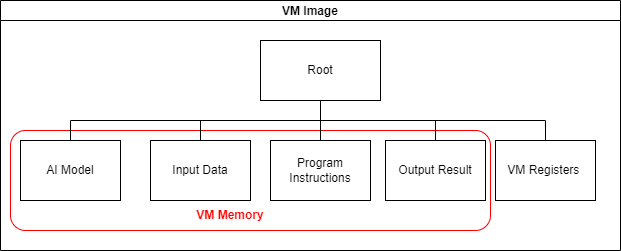
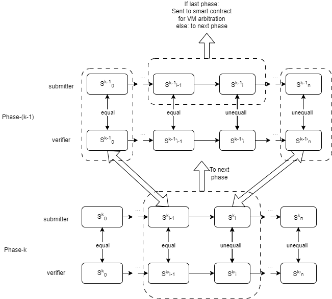
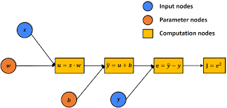

# OPML: Optimistic Machine Learning on Blockchain

## TL;DR

- We propose OPML (Optimistic Machine Learning), which enables AI model inference and training/fine-tuning on the blockchain system using optimistic approach.
- OPML can provide ML service with low cost and high efficiency compared to ZKML. The participation requirement for OPML is low: We are now able to run OPML with a large language model, e.g., 7B-LLaMA (the model size is around 26GB) on a common PC without GPU.
- OPML adopts a verification game (similar to Truebit and Optimistic Rollup systems) to guarantee decentralized and verifiable consensus on the ML service. 
  - The requester first initiates an ML service task.
  - The server then finishes the ML service task and commits results on chain.
  - The verifier will validate the results. Suppose there exists a verifier who declares the results are wrong. It starts a verification game with verification game (bisection protocol) with the server and tries to disprove the claim by pinpointing one concrete erroneous step.
  - Finally, arbitration about a single step will be conducted on smart contract.

## Single-Phase Verification Game

The one-phase pinpoint protocol works similarly to referred delegation of computation (RDoC), where two or more parties (with at least one honest party) are assumed to execute the same program. Then, the parties can challenge each other with a pinpoint style to locate the disputable step. The step is sent to a judge with weak computation power (smart contract on blockchain) for arbitration. 

In one-phase OPML:

- We build a virtual machine (VM) for off-chain execution and on-chain arbitration. We guarantee the equivalence of the off-chain VM and the on-chain VM implemented on smart contract.
- To ensure the efficiency of AI model inference in the VM, we have implemented a lightweight DNN library specifically designed for this purpose instead of relying on popular ML frameworks like Tensorflow or PyTorch. Additionally, a script that can convert Tensorflow and PyTorch models to this lightweight library is provided. 
- The cross-compilation technology has been applied to compile the AI model inference code into the VM program instructions.
- The VM image is managed with a Merkle tree, only the Merkle root will be uploaded to the on-chain smart contract. (the Merkle root stands for the VM state)

- The bisection protocol will help to locate the dispute step, the step will be sent to the arbitration contract on the blockchain

**Performance**: We have tested a basic AI model (a DNN model for MNIST classification) on a PC.We are able to complete the DNN inference within 2 seconds in the VM, and the entire challenge process can be completed within 2 minutes in a local Ethereum test environment.

## Multi-Phase Verification Game

### **Limitations of One-Phase Pinpoint Protocol**

The one-phase verification game has a critical drawback: all computations must be executed within the Virtual Machine (VM), preventing us from leveraging the full potential of GPU/TPU acceleration or parallel processing. Consequently, this restriction severely hampers the efficiency of large model inference, which also aligns with the current limitation of the referred delegation of computation (RDoC) protocol. 

### Transitioning to a Multi-Phase Protocol

To address the constraints imposed by the one-phase protocol and ensure that OPML can achieve performance levels comparable to the native environment, we propose an extension to a multi-phase protocol. With this approach, we only need to conduct the computation in the VM only in the final phase, resembling the single-phase protocol. For other phases, we have the flexibility to perform computations that lead to state transitions in the native environment, leveraging the capabilities of CPU, GPU, TPU, or even parallel processing. By reducing the reliance on the VM, we significantly minimize overhead, resulting in a remarkable enhancement in the execution performance of OPML, almost akin to that of the native environment.

The following figure demonstrates a verification game consists of two phases (k = 2). In Phase-1, the process resembles that of a single-phase verification game, where each state transition corresponds to a single VM microinstruction that changes the VM state. In Phase-2, the state transition corresponds to a "Large Instruction" encompassing multiple microinstructions that change the computation context.

The submitter and verifier will first start the verification game on Phase-2 using bisection protocol to locate the dispute step on a "large instruction". This step will be send to the next phase, Phase-1. Phase-1 works like the single-phase verification game. The bisection protocol in Phase-1 will help to locate the dispute step on a VM microinstruction. This step will be sent to the arbitration contract on the blockchain. 

To ensure the integrity and security of the transition to the next phase, we rely on the Merkle tree. This operation involves extracting a Merkle sub-tree from a higher-level phase, thus guaranteeing the seamless continuation of the verification process.

### Multi-Phase OPML

In this demonstration, we present a two-phase OPML approach, as utilized in the LLaMA model:

- The computation process of Machine Learning (ML), specifically Deep Neural Networks (DNN), can be represented as a computation graph denoted as $G$. This graph consists of various computation nodes, capable of storing intermediate computation results.
- DNN model inference is essentially a computation process on the aforementioned computation graph. The entire graph can be considered as the inference state (computation context in Phase-2). As each node is computed, the results are stored within that node, thereby advancing the computation graph to its next state.

- Therefore, we can first conduct the verification game on the computation graph (At phase-2). On the phase-2 verification game, the computation on nodes of the graph can be conducted in native environment using multi-thread CPU or GPU. The bisection protocol will help to locate the dispute node, and the computation of this node will be sent to the next phase (phase-1) bisection protocol.
- In Phase-1 bisection, we transform the computation of a single node into Virtual Machine (VM) instructions, similar to what is done in the single-phase protocol.

It is worth noting that we anticipate introducing a multi-phase OPML approach (comprising more than two phases) when the computation on a single node within the computation graph remains computationally complex. This extension will further enhance the overall efficiency and effectiveness of the verification process.

### Performance Improvement

Here, we present a concise discussion and analysis of our proposed multi-phase verification framework.

Suppose there are $n$ nodes in the DNN computation graph, and each node needs to take $m$ VM microinstructions to complete the calculation in VM. Assuming that the speedup ratio on the calculation on each node using GPU or parallel computing is $\alpha$. This ratio represents the acceleration achieved through GPU or parallel computing and can reach significant values, often ranging from tens to even hundreds of times faster than VM execution.

Based on these considerations, we draw the following conclusions:

1. Two-phase OPML outperforms single-phase OPML, achieving a computation speedup of $\alpha$ times. The utilization of multi-phase verification enables us to take advantage of the accelerated computation capabilities offered by GPU or parallel processing, leading to substantial gains in overall performance.
2. When comparing the sizes of the Merkle trees, we find that in two-phase OPML, the size is $O(m + n)$, whereas in single-phase OPML, the size is significantly larger at $O(mn)$. The reduction in Merkle tree size further highlights the efficiency and scalability of the multi-phase design.

In summary, the multi-phase verification framework presents a remarkable performance improvement, ensuring more efficient and expedited computations, particularly when leveraging the speedup capabilities of GPU or parallel processing. Additionally, the reduced Merkle tree size adds to the system's effectiveness and scalability, making multi-phase OPML a compelling choice for various applications.

## Consistency and Determinism

In OPML, ensuring the consistency of ML results is of paramount importance.

During the native execution of DNN computations, especially across various hardware platforms, differences in execution results may arise due to the characteristics of floating-point numbers. For instance, parallel computations involving floating-point numbers, such as $(a + b) + c$ versus $a + (b + c)$, often yield non-identical outcomes due to rounding errors. Additionally, factors such as programming language, compiler version, and operating system can influence the computed results of floating-point numbers, leading to further inconsistency in ML results.

To tackle these challenges and guarantee the consistency of OPML, we employ two key approaches:

1. Fixed-point arithmetic, also known as quantization technology, is adopted. This technique enables us to represent and perform computations using fixed precision rather than floating-point numbers. By doing so, we mitigate the effects of floating-point rounding errors, leading to more reliable and consistent results.
2. We leverage software-based floating-point libraries that are designed to function consistently across different platforms. These libraries ensure cross-platform consistency and determinism of the ML results, regardless of the underlying hardware or software configurations.

By combining fixed-point arithmetic and software-based floating-point libraries, we establish a robust foundation for achieving consistent and reliable ML results within the OPML framework. This harmonization of techniques enables us to overcome the inherent challenges posed by floating-point variations and platform disparities, ultimately enhancing the integrity and dependability of OPML computations.

## OPML vs ZKML

|                      | OPML                                                         | ZKML                                                         |
| -------------------- | ------------------------------------------------------------ | ------------------------------------------------------------ |
| model size           | any size (available for extremely large model)               | small/limited (due to the cost of ZKP generation)            |
| validity proof       | fraud proof                                                  | zero-knowledge proof (ZKP)                                   |
| training support* | √                                                            | ×                                                            |
| requirement          | Any PC with CPU/GPU                                          | Large memory for ZK circuit                                  |
| Finality             | Delay for challenge period                                   | No delays                                                    |
| service cost         | low (inference and training can be conducted in native environment) | extremely high (generating a ZKP for ML inference is extremely high) |
| security             | crypto-economic incentives for security                      | cryptographic security                                       |

*: Within the current OPML framework, our primary focus lies on the inference of ML models, allowing for efficient and secure model computations. However, it is essential to highlight that our framework also supports the training process, making it a versatile solution for various machine learning tasks.

Note that OPML is still under development. If you are interested in becoming part of this exciting initiative and contributing to the OPML project, please do not hesitate to reach out to us.
